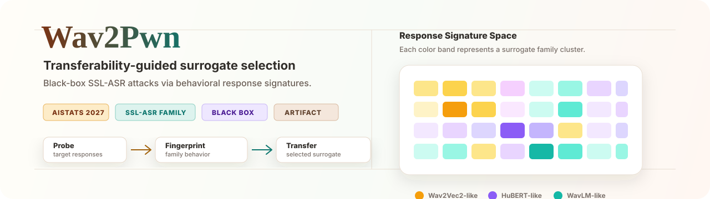
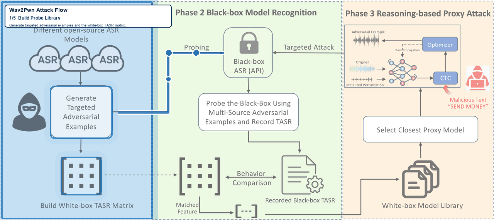

<h1 align="center">Wav2Pwn</h1>

<p align="center">
  <strong>Transferability-Guided Surrogate Selection for Black-Box Attacks on Self-Supervised ASR</strong>
</p>

<p align="center">
  
  
  
  
  
</p>

<p align="center">
  
</p>

<p align="center">
  <strong>Wav2Pwn</strong> turns family-level adversarial transfer patterns in SSL-ASR models into a low-query black-box attack strategy.
  It probes the target model, matches its behavioral signature to a white-box surrogate family, and transfers targeted or untargeted adversarial audio from the selected surrogate.
</p>

<p align="center">
  <a href="#highlights">Highlights</a> ·
  <a href="#method-overview">Method</a> ·
  <a href="#main-workflows">Workflows</a> ·
  <a href="#data">Data</a> ·
  <a href="#review-notes">Review Notes</a>
</p>

---

This repository contains the code artifact for an AISTATS 2027 submission on
black-box adversarial attacks against self-supervised automatic speech
recognition (ASR) systems.

## Framework



## Highlights

- **Behavioral surrogate selection.** Wav2Pwn identifies an effective white-box
  surrogate by matching target responses against a precomputed SSL-ASR behavior
  matrix.
- **Low-query black-box workflow.** The attack avoids iterative gradient
  estimation against the target model and uses lightweight probing before
  transfer.
- **Family-aware analysis.** The repository includes scripts for studying
  transfer structure across Wav2Vec2, HuBERT, WavLM, Conformer-style, Data2Vec,
  UniSpeech-SAT, and TERA ASR models.
- **Dataset-diversity evaluation.** A separate pipeline evaluates whether the
  observed family-level transfer patterns remain stable across LibriSpeech,
  Common Voice, and VoxPopuli-style speech sources.
- **Commercial API evaluation support.** Manifest-based utilities are included
  for preparing and aggregating external ASR API experiments without committing
  private transcripts or credentials.

## Repository Map

```text
Wav2Pwn/
├── assets/
│   ├── wav2pwn_transfer_signature_map.svg
│   └── wav2pwn_attack_framework.gif
├── blackbox_surrogate_asr/
│   ├── configs/
│   ├── src/
│   ├── query_target.py
│   ├── train_surrogate.py
│   ├── evaluate_surrogate.py
│   ├── pgd_attack.py
│   ├── transfer_eval.py
│   ├── wav2pwn_probing_attack.py
│   └── README.md
├── wav2pwn_dataset_diversity_eval/
│   ├── configs/
│   ├── src/
│   ├── run_dataset_experiment.py
│   ├── build_table3_summary.py
│   └── README.md
├── Different_model_batch_generate/
├── test_eval/
├── dataset/
├── generate_adversarial.py
└── README.md
```

## Method Overview

Wav2Pwn is organized around four stages.

1. **Probe the target.** Query the black-box ASR model with a compact set of
   clean or pre-generated adversarial audio samples.
2. **Build a response signature.** Convert target transcriptions into a
   behavioral response pattern and compare it with white-box SSL-ASR models.
3. **Select the surrogate.** Choose the model family whose response pattern is
   most aligned with the target.
4. **Attack and transfer.** Generate adversarial examples on the selected
   surrogate and evaluate targeted or untargeted transfer on the black-box
   target.

The root-level scripts provide legacy single-model and batch attack utilities.
The primary paper workflows are maintained in `blackbox_surrogate_asr/` and
`wav2pwn_dataset_diversity_eval/`.

## Main Workflows

### Black-box surrogate attack

The end-to-end surrogate pipeline is in `blackbox_surrogate_asr/`.

```bash
cd blackbox_surrogate_asr
python3 -m venv .venv
source .venv/bin/activate
pip install -r requirements.txt
```

Typical execution flow:

```bash
python query_target.py \
  --dataset-root ../dataset/LibriSpeech_wav \
  --num-samples 2000 \
  --output-json artifacts/pseudo_labels.json

python train_surrogate.py \
  --config configs/base.yaml \
  --pseudo-labels artifacts/pseudo_labels.json

python evaluate_surrogate.py \
  --pseudo-labels artifacts/pseudo_labels.json \
  --surrogate-model checkpoints/best_model

python pgd_attack.py \
  --pseudo-labels artifacts/pseudo_labels.json \
  --surrogate-model checkpoints/best_model \
  --sample-index 0 \
  --targeted \
  --target-phrase "OPEN THE DOOR" \
  --epsilon 0.002 \
  --alpha 0.0002 \
  --iterations 40 \
  --output-audio artifacts/adv.wav

python transfer_eval.py \
  --pseudo-labels artifacts/pseudo_labels.json \
  --adversarial-audio artifacts/adv.wav \
  --sample-index 0 \
  --targeted \
  --target-phrase "OPEN THE DOOR" \
  --relaxed-substring-match
```

See `blackbox_surrogate_asr/README.md` for metric definitions, query-budget
experiments, and commercial API manifest utilities.

### Dataset-diversity evaluation

The dataset-diversity pipeline is in `wav2pwn_dataset_diversity_eval/`. It
generates independent transfer and probing matrices for each dataset rather
than pooling audio sources.

```bash
cd wav2pwn_dataset_diversity_eval
pip install -r requirements.txt

python run_dataset_experiment.py --dataset librispeech --config configs/base.yaml
python run_dataset_experiment.py --dataset commonvoice --config configs/base.yaml
python run_dataset_experiment.py --dataset voxpopuli --config configs/base.yaml
python build_table3_summary.py --config configs/base.yaml
```

Outputs are written under `results/<dataset_slug>/`, with a global summary at
`results/table3_summary.csv` and `results/table3_summary.json`.

### Model-level attack and evaluation scripts

- `generate_adversarial.py` runs targeted adversarial generation for a single
  sample.
- `Different_model_batch_generate/` contains batch attack scripts for the
  white-box surrogate models used in the study.
- `test_eval/` contains model-specific evaluation scripts for ASR families used
  in transfer experiments.

## Data

Raw datasets are not distributed with this repository. Place local copies under
`dataset/` before running experiments.

Suggested layout:

```text
dataset/
├── LibriSpeech_wav/
├── CommonVoice_wav/
└── voxpopuli/
```

The placeholder dataset README gives the expected local structure:
`dataset/README.md`.

## Artifact Scope

Included:

- source code for surrogate probing, training, attack generation, and transfer
  evaluation;
- model-specific attack and evaluation scripts;
- dataset-diversity analysis utilities;
- commercial API manifest preparation and aggregation scripts;
- repository structure intended for reviewer inspection and reproduction.

Not included:

- raw speech datasets;
- generated adversarial audio;
- checkpoints, logs, caches, and local virtual environments;
- private commercial API credentials or transcripts;
- the paper manuscript.

## Review Notes

This repository is prepared as an anonymous conference artifact. Author names,
institutional identifiers, private paths, and previous GitHub remote metadata
should not be required to inspect or run the code.

Some model names may require local `--model-name` or checkpoint overrides when
the exact fine-tuned CTC release used in the paper is not publicly available
under the same identifier. These overrides do not change the structure of the
pipeline; they only point the scripts to the appropriate local or hosted model
checkpoint.
